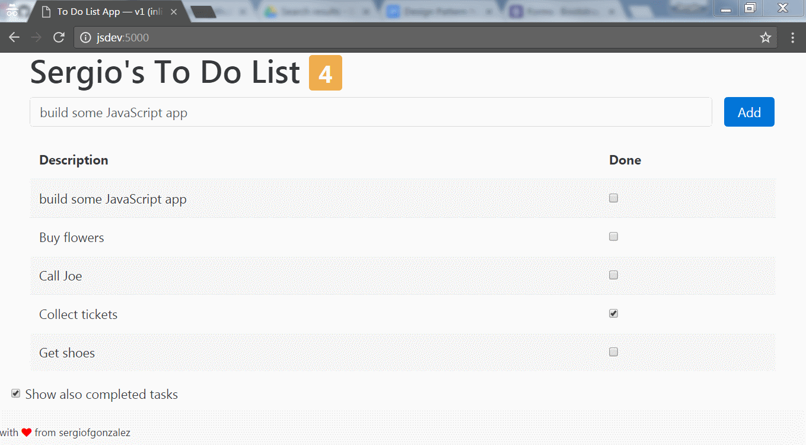

# 02-todo-app-v2-mock-data-http
> To Do List app built with AngularJS: getting model data through http 

## Description

In this version the static model in the `app.js` is changed for an HTTP call that retrieves the tasks from `/mock-data/todo.json`. In order to do that, we use `app.run` which tells AngularJS to execute it once the initial setup has been completed.

To retrieve the data from the `todo.json` file we use the `$http` service which returns a promise with the data.



The module, the main controller and a custom filter used in the application is defined in the `public/js/app.js`.
The model is hardcoded in the `app.js` too.

### AngularJS Capabilities Used
+ Angular Module definition and binding in the view
+ Defining a simple main controller
+ Defining a simple custom filter
+ one-way and two-way data binding between the model and the view
+ basic built-in directives: `ng-hide`, `ng-class`, `ng-repeat`, `ng-disabled`...
+ form validation: an empty task cannot be added

### Project Structure

The project structure is super simple:

```
./
|
|- build/           <- dist artifacts
|- public/          <- source code artifacts
|---- css/          <- custom CSS
|---- js/           <- JS application
|---- mock-data/    <- test data
|---- index.html    <- main view
```

### Build Tool: Tasks

*NPM* is used for the build tool, so make run you run `npm install` before running any of the tasks.

The following options are meaningful for this project:
+ `npm run clean` &mdash; Clean the build directory, where the project is *compiled*.
+ `npm run lint` &mdash; Run the JS linter on the `public/js` directory files.
+ `npm run dev` &mdash; Build the artifacts from source/, deploys a debug version on `build/` and starts up a simple HTTP server to serve the `build directory`.
