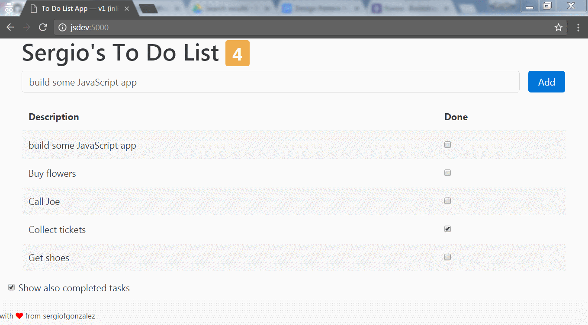

# 03-todo-app-v3-refactoring-with-directives
> To Do List app built with AngularJS: using directives

## Description

In this version, we define a couple of additional modules `todoAppHeaderModule` and `todoAppTaskFormModule` and inside them we define a couple of AngularJS directives.
Angular directives allow you to define *extensions* to the HTML language to modularize views and behavior. In this case, we define the directives:
+ `<tasks-header></tasks-header>` &mdash; The header with the user name and the remaining tasks.
+ `<new-task-form></new-task-form>` &mdash; The form that lets the user define new tasks.

In this particular example it seems a little bit unnatural, and a little bit of an overkill, but it let us see how easy it is to fragment sections of a complicated view to simplify it.

Note also that now, we have to make the main module `app.js` explicitly depend on the newly defined modules:
```javascript
  /* define todoApp module: deps with modules defining the directives are included */
  var app = angular.module("todoApp", ["todoAppHeaderModule", "todoAppTaskFormModule"]);
```



The module, the main controller and a custom filter used in the application is defined in the `public/js/app.js`.
The model is hardcoded in the `app.js` too.

### AngularJS Capabilities Used
+ Angular Module definition and binding in the view
+ Defining a simple main controller
+ Defining a simple custom filter
+ one-way and two-way data binding between the model and the view
+ basic built-in directives: `ng-hide`, `ng-class`, `ng-repeat`, `ng-disabled`...
+ form validation: an empty task cannot be added
+ directives

### Project Structure

The project structure is super simple:

```
./
|
|- build/           <- dist artifacts
|- public/          <- source code artifacts
|---- css/          <- custom CSS
|---- js/           <- JS application
|---- mock-data/    <- test data
|---- index.html    <- main view
```

### Build Tool: Tasks

*NPM* is used for the build tool, so make run you run `npm install` before running any of the tasks.

The following options are meaningful for this project:
+ `npm run clean` &mdash; Clean the build directory, where the project is *compiled*.
+ `npm run lint` &mdash; Run the JS linter on the `public/js` directory files.
+ `npm run dev` &mdash; Build the artifacts from source/, deploys a debug version on `build/` and starts up a simple HTTP server to serve the `build directory`.
