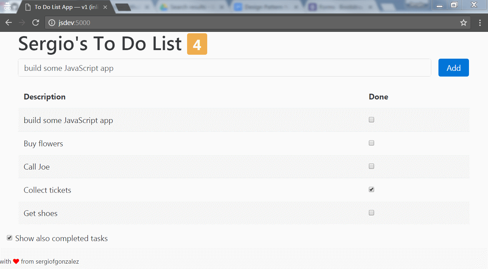

# 04-todo-app-v4-express
> To Do List app built with AngularJS: serving the app from a custom *Express* application

## Description
The major change in this version is that instead of using the `http-server` module that did not match very well my project structure, I'm using a simple, custom-developed, *Express* application that serves the contents of the `public/` directory.

The project structure has been also slightly modied to accommodate both the *server* and *client* applications (see project structure below).

Regarding the client application, on top of the previous version of the application a simple fix is introduced to clean the contents of the task textfield after the user has clicked on the *Add* button.

This consists in two things:
1. A new property has been added to the controller to hold a two-way data binding with the contents of the textfield.
```javascript
...
  /* placeholder for the new task */
  this.actionText = "";

  /* add a new item to the list of tasks */
  this.addNewItem = function (actionText) {
    this.todoInfo.items.push({action: actionText, done: false});
    this.actionText = "";
  };
...
```
2. In the view, the binding of the textfield and the call to the controller function has to be updated:
```html
...
<input type="text" class="form-control" id="task" placeholder="type task description" ng-model="toDoCtrl.actionText" required>
<button type="button" class="btn btn-primary" ng-click="toDoCtrl.addNewItem(toDoCtrl.actionText)" ng-disabled="taskForm.$invalid">Add</button>
...
```



The module, the main controller and a custom filter used in the application is defined in the `public/js/app.js`.
The model is hardcoded in the `app.js` too.

### AngularJS Capabilities Used
+ Angular Module definition and binding in the view
+ Defining a simple main controller
+ Defining a simple custom filter
+ one-way and two-way data binding between the model and the view
+ basic built-in directives: `ng-hide`, `ng-class`, `ng-repeat`, `ng-disabled`...
+ form validation: an empty task cannot be added
+ directives

### Project Structure

The project structure has been modified to accommodate the server application:

```
./
|
|- build/             <- dist artifacts
|- src/               <- source code artifacts
|--- public/          <- source code artifacts
|------ css/          <- custom CSS
|------ js/           <- JS application
|------ mock-data/    <- test data
|------ index.html    <- main view
|--- lib/             <- server support modules (conf, etc.)
|--- index.js         <- server source code (Express application)
|--- application.yml  <- server configuration properties (server port, logging level, ...)
```

### Build Tool: Tasks

*NPM* is used for the build tool, so make run you run `npm install` before running any of the tasks.

The following options are meaningful for this project:
+ `npm run clean` &mdash; Clean the build directory, where the project is *compiled*.
+ `npm run lint` &mdash; Run the JS linter on the `public/js` directory files.
+ `npm run dev` &mdash; Build the artifacts from source/, deploys a debug version on `build/` and starts up a simple HTTP server to serve the `build directory`.
